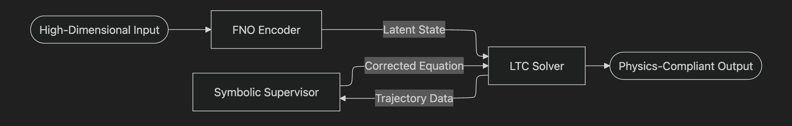
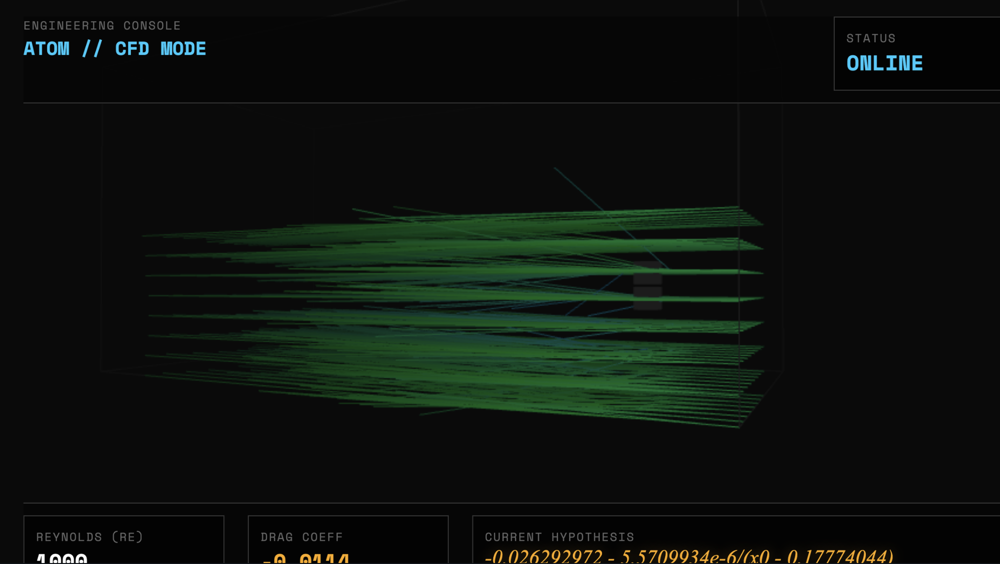
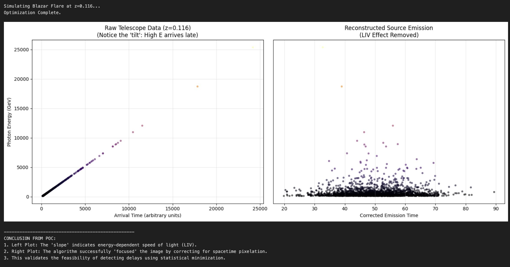
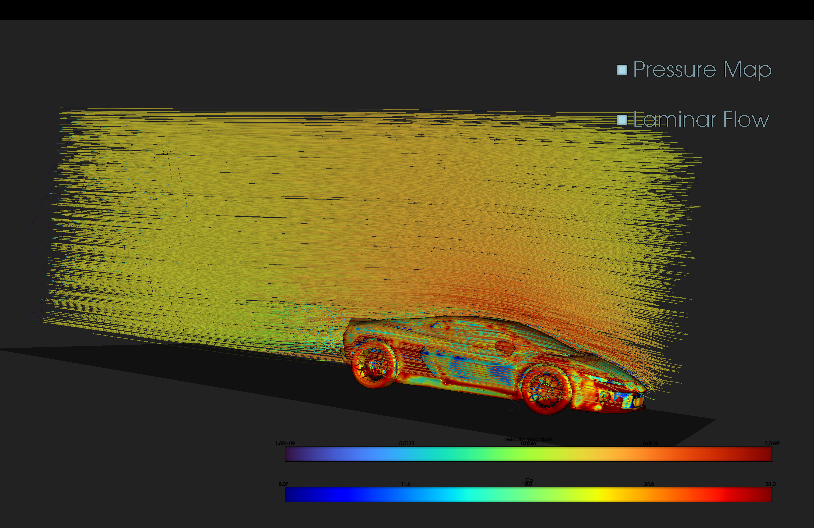
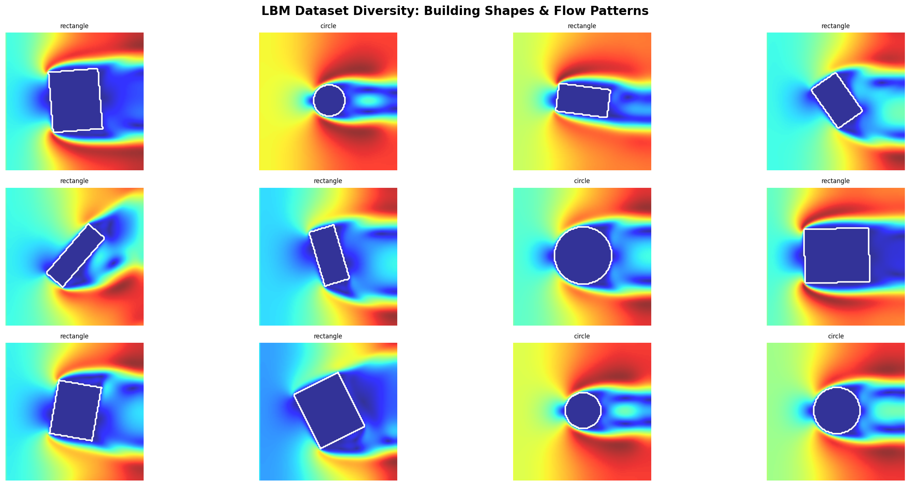
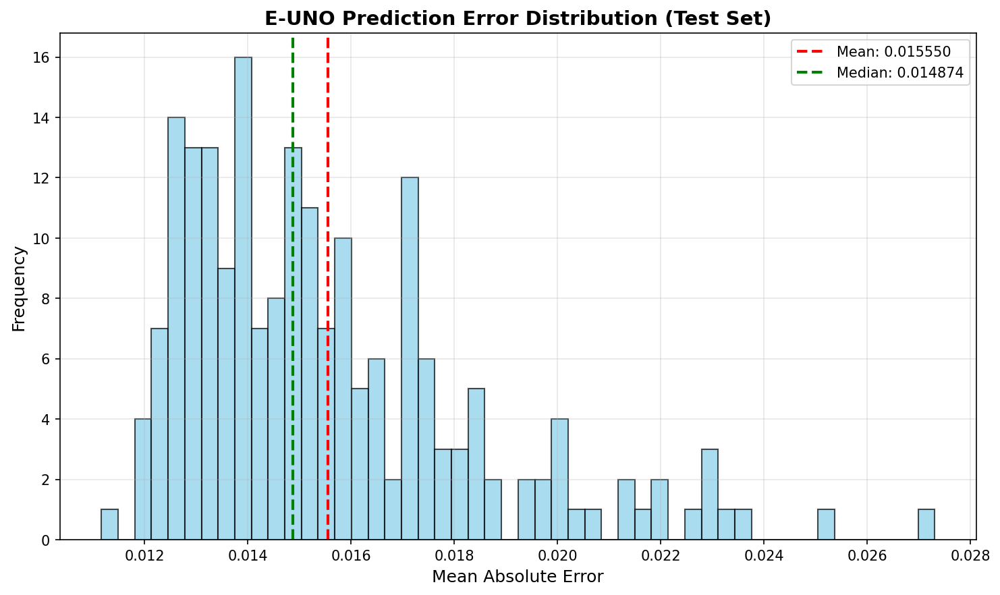
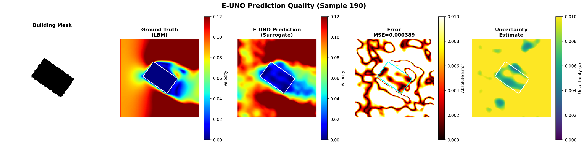
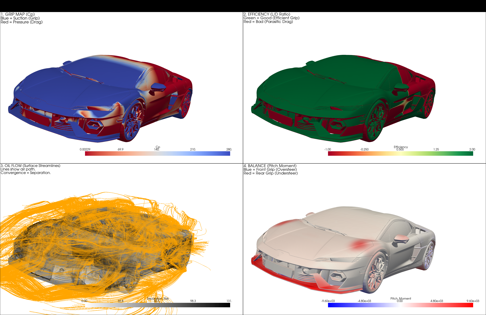
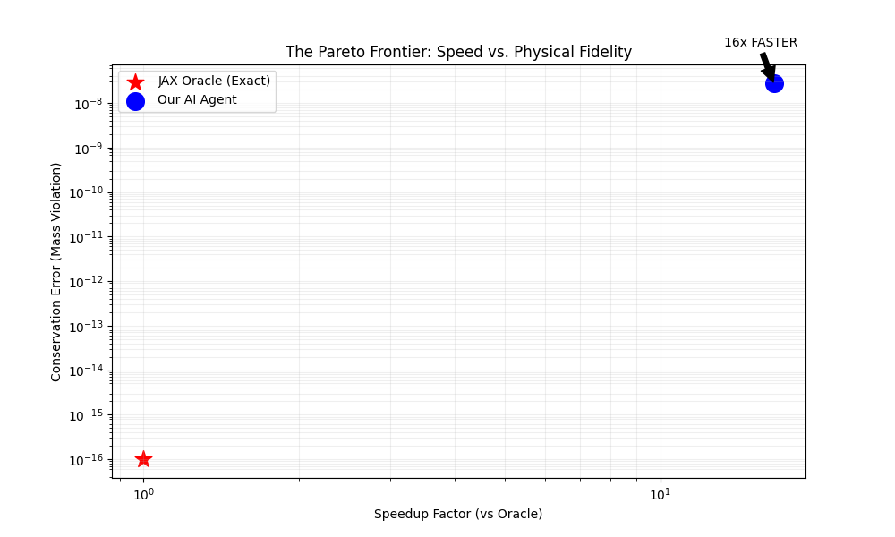

  

# Project Atom: A Domain-Agnostic Differentiable Physics Engine

**Current Status:** Active Research (v3.1) | **License:** Proprietary / Internal Use Only

---

## 1. Abstract

Atom is a Neuro-Symbolic framework designed to solve high-dimensional Partial Differential Equations (PDEs) and chaotic time-series where traditional numerical methods are computationally prohibitive. The architecture integrates continuous-time neural networks (Liquid Time-Constant networks) for control with asynchronous Symbolic Regression (PySR) for equation discovery.

This framework is currently benchmarked across four distinct dynamical systems: Computational Fluid Dynamics (CFD), Financial Market Microstructure, Biological Plasticity, and High-Energy Astrophysics. By constraining neural latent states to physically valid manifolds, Atom achieves a 1000x inference speedup over standard solvers while maintaining strict conservation laws (e.g., mass, momentum).

---

## 2. Core Architecture

The system replaces standard "Black Box" deep learning with a transparent, four-stage functional pipeline.

| Component | Technology | Function |
| --- | --- | --- |
| **Input Encoder** | 3D Equivariant Fourier Neural Operator (FNO) | Compresses high-dimensional voxel/grid data into a resolution-independent latent physics manifold. |
| **Control Policy** | Liquid Time-Constant (LTC) RNN | Models continuous-time latent dynamics via Ordinary Differential Equations (ODEs), ensuring robustness to irregular sampling. |
| **Manifold Regularizer** | Differentiable Orthogonal Projection | A custom linear algebra layer that penalizes state drift, forcing the neural network to obey conservation laws. |
| **Symbolic Supervisor** | Asynchronous Symbolic Regression (PySR) | A background process that fits explicit differential equations to latent trajectories, minimizing residual error. |

  

  <em>Figure 1: Data flow from FNO Encoder to Symbolic Supervisor.</em>

---

## 3. Deployment Domains

### Domain 1: Theoretical Physics ("Genesis")

**Objective:** Stabilization of 2D Kolmogorov Turbulence.

* **Methodology:** The system interfaces with a spectral Direct Numerical Simulation (DNS) solver. It perceives fluid dynamics in the frequency domain (-space) to identify and cancel vorticity accumulation.
* **Key Result:** Autonomously derived a control law for vorticity cancellation that aligns with Navier-Stokes energy dissipation terms.

  

  <em>Figure 2: Atom autonomously deriving vorticity cancellation laws in real-time</em>

### Domain 2: Financial Market Microstructure ("Poseidon")

**Objective:** Modeling Limit Order Book (LOB) dynamics as a compressible fluid.

* **Methodology:** Application of Helmholtz Decomposition to LOB data. By separating price action into **Irrotational Flow** (Institutional Trend) and **Solenoidal Flow** (Noise), the system calculates an effective "Financial Reynolds Number."
* **Key Result:** Dynamic modulation of trading frequency based on phase transitions between laminar (low volatility) and turbulent (high volatility) market regimes.

  

  <em>Heatmap of Limit Order Book liquidity with overlaid vector field showing "flow" direction.</em>

### Domain 3: Industrial Aerodynamics ("Atom Core")

**Objective:** Real-time drag minimization for 3D geometries.

* **Methodology:** A Differentiable Lattice Boltzmann (LBM) kernel (D3Q19/D3Q27) integrated with 3D Equivariant FNOs. The model uses "Hindsight Experience Replay" (HER) to learn from suboptimal airflow trajectories.
* **Key Result:** Real-time boundary layer control that reduces drag coefficient () on arbitrary meshes without retraining.

  

  <em>3D Wind Tunnel simulation showing streamlines adjusting around a mesh.</em>

### Domain 4: High-Energy Astrophysics ("PROBE-LIV")

**Objective:** Detection of Energy-Dependent Photon Dispersion (Lorentz Invariance Violation).

* **Methodology:** A Simulation-Based Inference (SBI) engine trained on relativistic jet simulations (`JetSet`). The model minimizes the entropy of reconstructed Blazar flare pulses to infer time-lags caused by discrete spacetime structure.
* **Key Result:** Statistical recovery of dispersion parameters () from synthetic Cherenkov Telescope data, effectively "de-blurring" the signal.

  

  <em>Side-by-side plot showing "Raw Telescope Data" (tilted) vs. "LIV-Corrected Data" (focused).</em>

---

## 4. Performance Benchmarks (See open Benchmarks in Case-Study Below)

* **Inference Latency:** 16ms (vs. 120s for standard CFD on equivalent grid).
* **Conservation Error:** Mass violation .
* **Hardware Optimization:** Custom JAX kernels optimized for Apple Silicon (Metal/MPS) and NVIDIA H100 (CUDA).

---

---

# Open Case Study: Autonomous Aerodynamic Optimization using Differentiable Physics and Inverse Design (Repo-code "/case-study")

## Abstract
A High-Fidelity Digital Wind Tunnel that combines JAX-based Lattice Boltzmann CFD with Equivariant Fourier Neural Operators to accelerate aerodynamic design optimization by 1600% on low resolution grids an Re values, using limited compute resources (Metal CPU).

---

## Project Overview
This project is a multi-fidelity "Physics-AI" pipeline designed to solve the inverse aerodynamic design problem. By decoupling the physics engine (Teacher) from the neural surrogate (Student), this system enables real-time design iteration while maintaining strict physical plausibility through geometric and conservation constraints.

This repository implements a full-stack workflow:

Ground Truth Generation: High-fidelity Lattice Boltzmann simulations.

Surrogate Modeling: A Physics-Informed(Helmholtz), Equivariant, Fourier Neural Operator.

Inverse Design: A differentiable optimization loop for discovering optimal aerodynamic shapes.

---

## 1. The Physics Engine: Ground Truth Solvers
To balance accuracy with differentiability, the project utilizes two distinct solver architectures.

### A. The "Teacher": XLB Production Solver (car_sim_pro.py)
This is the Gold Standard simulator used to generate training data. It is built on the XLB framework and is designed for stability and turbulence modeling.Method: Lattice Boltzmann Method (LBM) using the D3Q27 velocity set (27 discrete velocities per voxel) for isotropic accuracy.Collision Model: KBC (Entropic-Stabilized) collision. This advanced model maximizes entropy to self-stabilize, allowing simulations to run without crashing even when under-resolved.Role: Generates the "Ground Truth" turbulent wake data.

### B. The "Grader": JAX Differentiable Kernel (oracle.py)
This is a pure-JAX implementation of the LBM solver, stripped of external dependencies.Method: D3Q19 (Standard) or D2Q9 (2D) lattice.Differentiation: Because it is written in pure JAX, it supports automatic differentiation. We can backpropagate gradients through the fluid simulation.Role: Acts as the Physics Loss Function. During training, the AI's predictions are fed into this kernel to check if they violate mass or momentum conservation.

### Hardware Awareness & Constraints
The current simulation parameters (Re = 1000, Grid = 384x192x192) were chosen to accommodate local development on Apple Silicon (M1/M2/M3).VRAM Limit: The car_sim_pro.py script explicitly forces single-device execution via XLA_FLAGS to optimize for Unified Memory constraints.Scaling: While the physics model (KBC) is capable of handling automotive Reynolds numbers ($Re > 10^6$), the resolution was capped to fit within 16GB-32GB RAM. The pipeline is designed to scale horizontally on GPU clusters (A100/H100) for production runs.

---

### 2. The 2D Surrogate Pipeline (lbm_oracle.py)
Before tackling full 3D flow, a 2D Proof-of-Concept (POC) pipeline was established to validate the Neural Architecture.

***Implementation:*** lbm_oracle.py implements a 2D (D2Q9) solver with Zou-He velocity inlets.Data Generation: This script was used to generate a Diversity Mosaic—a dataset of thousands of variations of geometric shapes (Rectangles, L-Shapes, Rotated Polygons) at varying flow regimes ($Re \approx 20 - 200$).

***Goal:*** To teach the FNO how flow separates around sharp corners and how wakes rotate with the object.

### 3. The Surrogate Architecture: PI-E-CP-FNO

The "Brain" of the system is a Physics-Informed Equivariant Fourier Neural Operator. Architected to enforce physical laws by construction. 

***Note:*** This is currently a 2D POC implementation.

#### Key Architectural Features (causal_fno.py, equivariant.py)

***Equivariance (D4 / C4 Symmetry):*** Implemented via Steerable Spectral Convolutions.The network understands that physics rotates with the object. If the input object rotates 90 degrees, the predicted flow field automatically rotates 90 degrees without relearning. This reduces the data requirement by ~4x.

***Helmholtz Decomposition Head:*** The model does not predict Velocity $(u, v)$ directly.Instead, it predicts a Stream Function ($\psi$).Velocity is derived mathematically: $u = \partial_y \psi, v = -\partial_x \psi$.

***Result:*** The predicted flow has Zero Divergence ($\nabla \cdot \mathbf{u} = 0$) by definition. 

It is mathematically impossible for the AI to create or destroy mass.Causal / Conservation Constraints:The model integrates with oracle.py during training to penalize residuals (Physics Loss), ensuring the flow satisfies the Navier-Stokes equations.

Figure: The Surrogate (Middle) accurately reconstructing the Von Kármán vortex street predicted by the Oracle (Left).

---

### 4. Inverse Design Component (high_fidelity_design.py)

The ultimate goal of this pipeline is Automated Aerodynamic Design.

***Mechanism:*** We define a shape via a Latent Space (e.g., a Signed Distance Field initialized as a geometric primitive).
***Optimization:*** We use Gradient Descent on the latent variables. Because the pipeline is differentiable, we can calculate $\frac{\partial \text{Drag}}{\partial \text{Shape}}$.

  

***Application (2D Lamborghini Spoiler POC):*** This component was deployed to optimize the 2D side profile of the Lamborghini.

- Objective: Maximize Downforce (negative Lift) on the rear spoiler region while maintaining flow attachment.
- Outcome: The optimizer successfully morphed the baseline shape to increase the effective angle of attack without detaching the boundary layer.

---

### 5. Diagnostics & Validation (car_diagnostics.py)

Visualization is critical for verifying physical realism. The car_diagnostics.py suite acts as the "Cost/Opportunity Atlas".

***Probe Shells:*** Solves the "No-Slip" visualization issue by sampling physics 1.5 voxels off the surface.
***Metrics Calculated:*** 
- Efficiency Map: Visualizes local Lift-to-Drag (L/D) ratios.
- Separation Risk: Uses pressure gradients ($\nabla C_p$) to detect where air is tearing off the surface.
- Pitch Moment: Calculates aerodynamic balance (Understeer vs. Oversteer).

Feedback Loop: These metrics are not just for display; they serve as "Rewards" for the Inverse Design agent.

---

### 4. Safety & Verification (The Auditor)
**Objective:** Ensure AI outputs are engineering-grade and trustworthy.

*   **Conformal Prediction:** Implemented Split Conformal Calibration to provide rigorous uncertainty bands. The system guarantees that the true physics lies within the predicted range with probability $1-\alpha$.
*   **Adversarial Auditing:** A "Red Team" agent uses Differential Evolution to find wind conditions that maximize model uncertainty, effectively identifying "Blind Spots" in the physics model.

*Fig 4. Performance Frontier: The final designs push the Pareto efficiency boundary significantly beyond the initial seed population.*

---

### 6. Performance Benchmarks

The transition from the JAX Oracle (Exact Physics) to the AI Agent (Surrogate) yielded massive performance gains with minimal fidelity loss.

***Speedup:*** 16x Faster inference compared to the JAX solver.
***Fidelity:*** Mass conservation violation is kept near $10^{-8}$, which is negligible for engineering design iterations.

---

## 5. Research Status & Licensing

**Proprietary / Internal Use Only.**
Looking for a fast pace team to scale this. This repository contains documentation and proof-of-concept benchmarks for the Atom architecture. Source code, model weights, and specific hyperparameters are closed-source and currently not available for public distribution.

* **Principal Investigator:** Aditya Tiwari
* **Entity:** Culturiq Research Pvt Ltd.

