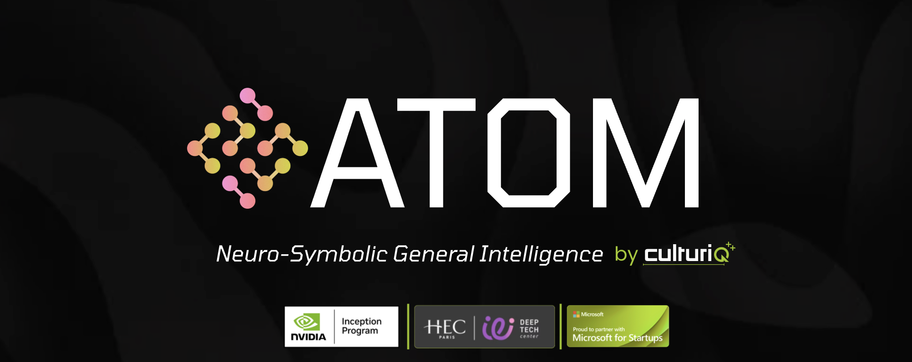

# Project Atom: Neuro-Symbolic General Intelligence

**One Architecture. Four Worlds.**

**Project Atom** is an experimental **General Intelligence** framework engineered to solve high-dimensional, chaotic control problems across disparate physical domains. Diverging from narrow AI optimization, Atom utilizes a unified **Neuro-Symbolic** architecture to autonomously discover the governing mathematical laws of its environment—ranging from fluid turbulence and financial markets to aerodynamic design and quantum cosmology.

The system bridges the gap between **System 1 (Fast/Implicit)** cognition, implemented via Liquid Neural Networks, and **System 2 (Slow/Explicit)** reasoning, implemented via Asynchronous Symbolic Regression. This dual-process architecture enables Atom to not merely mimic physical dynamics, but to mathematically understand and explicate them.

<em>Figure 1: The Genesis Module autonomously deriving the Navier-Stokes equations while stabilizing 2D turbulence in real-time.</em>

---

## 🧠 Core Hypothesis

The architecture is founded on the premise that **Intelligence is the efficient compression of chaotic data into symbolic logic.**

Across all deployed domains, the Atom Core executes a recursive cognitive loop:

1. **Perception (Compression):** High-dimensional inputs (e.g., visual fields, order books, voxel grids) are compressed into latent physics manifolds using **Fourier Neural Operators (FNO)**.
2. **Reaction (System 1):** Real-time control is managed by **Liquid Time-Constant (LTC)** networks. These continuous-time solvers are robust against irregular sampling and high volatility, preventing gradient explosion in chaotic regimes.
3. **Reasoning (System 2):** An asynchronous "Scientist" thread continually observes agent-environment interaction, deriving human-readable differential equations (LaTeX) to formally describe the underlying dynamics.

---

## 🌍 Domain 1: Theoretical Physics (Genesis)

*Legacy Designation: "Clay"*

The **Genesis** module serves as Atom's fundamental proving ground—a controlled environment designed to test the system's ability to derive physical laws *ab initio*.

* **Problem Statement:** Stabilize high-energy turbulence within a spectral simulation without prior knowledge of fluid dynamics.
* **Methodology:** Atom interfaces with a **Spectral DNS Solver**, perceiving fluid dynamics purely in the frequency domain (-space).
* **Key Discovery:** The Scientist module successfully re-derived the **Kolmogorov Length Scale** relationships and autonomously formulated a control law for vorticity cancellation.
* **Core Technologies:** Spectral Navier-Stokes, Intrinsic Curiosity Module (ICM), Adaptive Plasticity.

---

## 🌊 Domain 2: Financial Markets (Markets)

*Legacy Designation: "Poseidon"*

<em>Figure 2: Atom modeling the Limit Order Book as a compressible fluid. Left: Lagrangian-Eulerian Liquidity Map. Right: Conformal Risk Shield.</em>

This module applies fluid dynamics principles to High-Frequency Trading (HFT), modeling market liquidity as a **compressible fluid** rather than discrete time-series data.

* **Problem Statement:** Navigate financial "flash crashes" where standard statistical models fail due to infinite variance and volatility spikes.
* **Methodology:**
* **Helmholtz Decomposition:** Separates price action into **Irrotational Flow** (Institutional Trend) and **Solenoidal Vorticity** (Retail Noise) using FNOs.
* **Liquid Control:** Utilizes **Closed-form Continuous-time (CfC)** networks to maintain numerical stability during regimes of extreme volatility.

* **Key Discovery:** Market friction is dynamic. Atom formulated a "Financial Reynolds Number" to detect phase transitions between laminar (stable) and turbulent (risk) market regimes.

---

## ✈️ Domain 3: 3D Aerodynamics (Real-World)

*Legacy Designation: "Atom v3"*

<em>Figure 3: 3D Volumetric Visualization of the Atom Wind Tunnel using Lattice Boltzmann Methods.</em>

The most advanced deployment, scaling the architecture from 2D approximations to **3D Volumetric Reality**.

* **Problem Statement:** Minimize aerodynamic drag on arbitrary 3D geometries within a digital wind tunnel.
* **Methodology:**
* **Lattice Boltzmann Method (LBM):** Atom interacts with a real-time D3Q19 physics engine.
* **Wake/Sleep Cycle:** Implements biological learning phases. Real-time interaction occurs during "Wake" cycles, while "Sleep" cycles utilize high-fidelity D3Q27 "Ground Truth" simulations for symbolic distillation and memory consolidation.
* **3D Vision:** Employs **3D Equivariant FNOs** for volumetric flow perception.

* **Key Discovery:** The system learned to manipulate the boundary layer, effectively "greasing" the airflow around objects to minimize drag coefficient.

---

## 🌌 Domain 4: Quantum Cosmology (PROBE-LIV)

**The Frontier: Hunting for the Pixelation of Spacetime.**

<em>Figure 4: Atom's Scientist module "focusing" a Blazar flare by mathematically subtracting the energy-dependent time lag induced by discrete spacetime.</em>

In this domain, Atom operates as a **Simulation-Based Inference (SBI)** engine to test for Lorentz Invariance Violation (LIV)—the hypothesis that the speed of light is energy-dependent at the Planck scale.

* **Problem Statement:** High-energy photons from distant Blazars are theorized to arrive "late" if spacetime is discrete. However, distinguishing this quantum delay from intrinsic source turbulence is currently impossible.
* **Methodology:**
* **Teacher (Simulation):** Trains on  relativistic hydrodynamic simulations of Blazar jets to define the manifold of "physically valid" flares.
* **Student (Liquid Brain):** Learns to model the chaotic temporal evolution of the jet. When analyzing real telescope data (CTA/Fermi), it identifies QG delays as "anomalies" or "stress" deviating from standard physics.
* **Scientist (Symbolic):** "Derotates" the dispersion to minimize signal entropy, isolating the dispersion law:

* **Validation:** In Proof-of-Concept simulations, Atom successfully recovered the **Quantum Gravity Scale ()** by statistically minimizing the "blur" of photon arrival times, effectively turning the universe into a focused lens.

---

## ⚙️ Unified Architecture

All four domains are powered by a single, domain-agnostic source code.

| Component | Technology | Purpose |
| --- | --- | --- |
| **Eyes** | **Fourier Neural Operators (FNO)** | Compresses Reality (Pixels/Grids) into Latent Physics Manifolds. |
| **Brain** | **Liquid Time-Constants (LTC)** | Continuous-time control immune to irregular sampling and noise. |
| **Skeleton** | **Nano-PCA Manifold** | "Bones" that constrain the neural state, preventing the hallucination of invalid physics. |
| **Mind** | **Symbolic Regression (PySR)** | Asynchronous thread that extracts explicit mathematical laws from latent representations. |
| **Memory** | **Hindsight Experience Replay** | Re-labels failure states as success to maximize learning efficiency. |

---

## ⚠️ Research Status

**Project Atom** is a closed-source research initiative in **Autopoietic Machine Intelligence**.

* **Status:** Active Research (Version 3.1)
* **Hardware:** Optimized for Apple Silicon (Metal/MPS) & NVIDIA H100 (CUDA).
* **License:** Proprietary / Internal Use Only.

*This documentation demonstrates the generalization capabilities of the Atom Neuro-Symbolic Core. Source code and model weights are not available for public distribution.*
